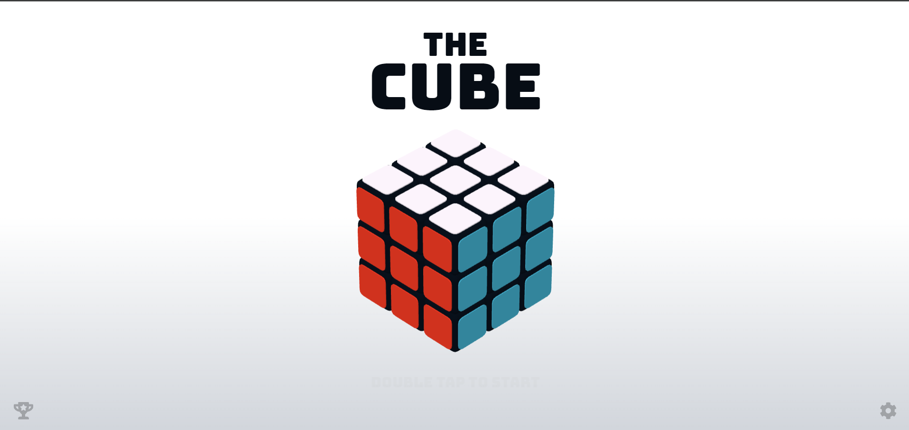
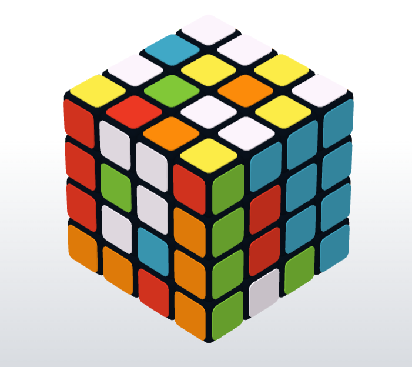
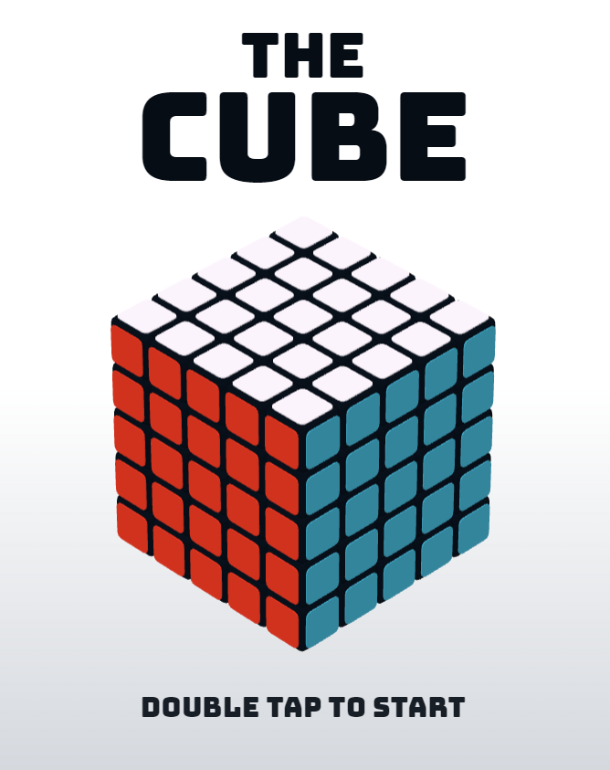
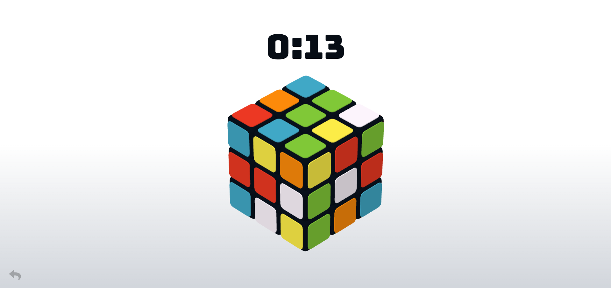
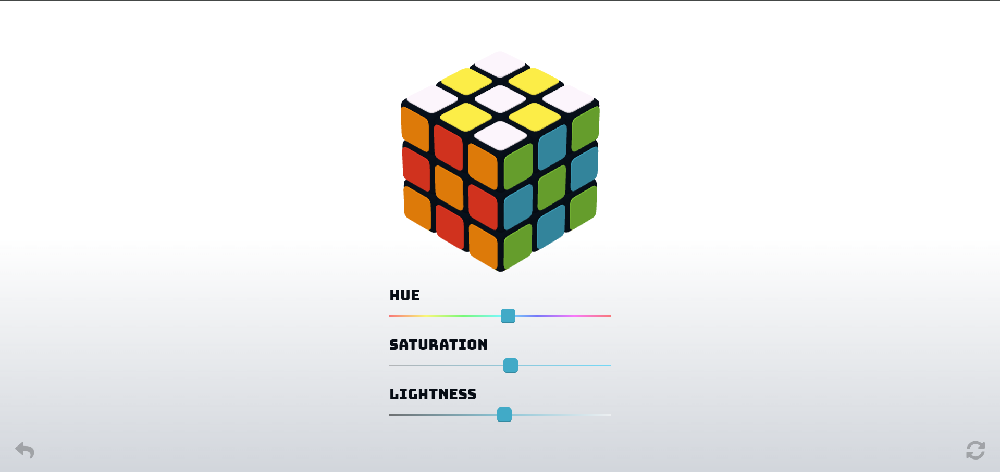
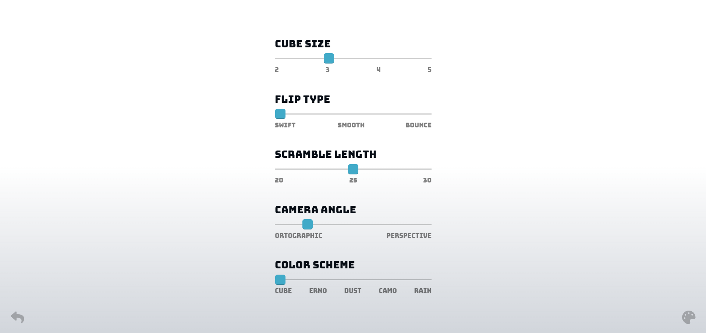

# 3D Rubik's Cube Game

An immersive, interactive 3D Rubik's Cube simulation built using HTML, CSS, JavaScript, and Three.js. Challenge yourself to solve not only the classic 3x3 cube but also the 2x2, 4x4, and even 5x5 versions, right in your browser!

## Features
- **Multiple Cube Sizes**: Choose from the classic **3x3**, the simpler **2x2**, or increase the difficulty with **4x4** and **5x5** cubes.
- **3D Rendering**: Smooth, realistic 3D visuals powered by `Three.js`.
- **Interactive Controls**: Rotate and manipulate the cube with mouse or touch interactions.
- **Scramble Functionality**: Start from a scrambled cube and test your puzzle-solving skills.
- **Smooth Animations**: Realistic cube rotation and animation transitions for a seamless experience.
- **Time Tracking**: Track how fast you can solve the cube for each size.
- **Mobile and Desktop Support**: Responsive design that works across all devices, so you can play on-the-go.

## How to Play
1. **Select Cube Size**: Choose your preferred cube size (2x2, 3x3, 4x4, or 5x5) from the options available.
2. **Scramble the Cube**: Hit the scramble button to jumble the cube.
3. **Rotate and Solve**: Click and drag to rotate cube layers or the entire cube.
4. **Track Your Time**: Watch the timer as you solve and try to beat your best time!

## Installation
1. Clone the repository or download the ZIP file.
    ```bash
    git clone https://github.com/your-username/rubiks-cube-game.git
    ```
2. Open the `index.html` file in your web browser.

## A Glance at the Website

### The easy 2x2 cube - a great starting point!


### The classic 3x3 cube - a true challenge for puzzle enthusiasts.


### The 4x4 cube - more pieces, more complexity!


### The ultimate 5x5 cube - for the bravest solvers.


### Scramble mode - can you solve it?



### Customize your cube




## Technologies Used
- **HTML5**
- **CSS3**
- **JavaScript (ES6)**
- **Three.js** - For rendering 3D graphics and interactions.

## How It Works
- The game uses `Three.js` to create and render the 3D cube.
- Players can interact with the cube by dragging layers to rotate, replicating the mechanics of a physical Rubik’s Cube.
- Cube scrambling is handled by generating random moves, offering endless variations.
- The size of the cube can be changed dynamically between 2x2, 3x3, 4x4, and 5x5 configurations.

## Future Enhancements
- **Undo/Redo Functionality**: Allow players to undo moves and keep track of their solving process.
- **Leaderboard**: Compete with friends and others globally with a leaderboard for solving times.
- **Custom Themes**: Customize the look of your cube with different colors and textures.
- **Hints Mode**: Add hints for beginner players to help guide their next moves.


